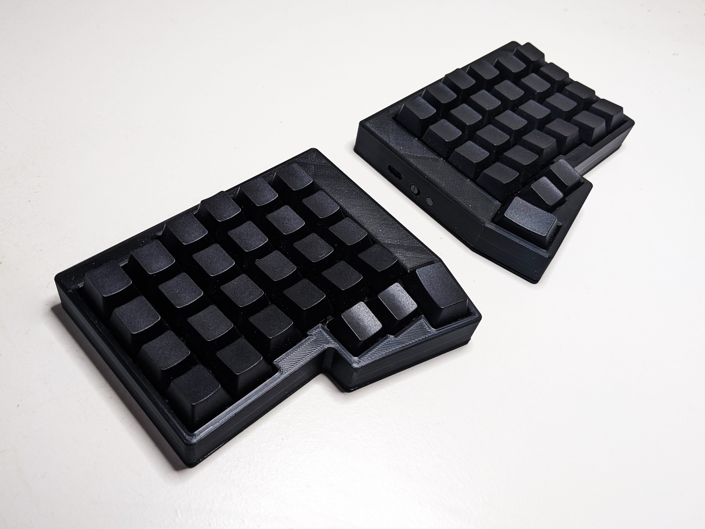

# Conejo

## Overview

The Conejo is an OSH split, columnar-staggered, 54-key keyboard inspired by the [Iris](https://keeb.io/products/iris-keyboard-split-ergonomic-keyboard), [Lily58](https://github.com/kata0510/Lily58), and [Corne](https://github.com/foostan/crkbd) and powered by the [ZMK Firmware](https://github.com/zmkfirmware/zmk).

For more information, see the [project wiki](https://github.com/kurtis-lew/Conejo/wiki).

## Repository Structure
- KiCAD Project files are located in the root folder
- Gerbers for PCB fabrication are located in `exports/gerbers`.
- `.3mf` files for 3D printing cases are located in `exports/3D`
- An interactive BOM is located in `exports/bom`